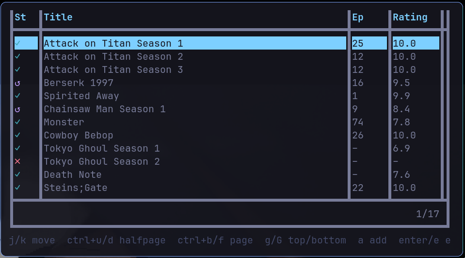

# anitui



A terminal anime watch-list. Flat CSV storage, single static binary, no server.

## Features

- Full-screen table with fuzzy search, status filtering, and sorting (added, last watch, started, completed, rating, title)
- Status changes, deletion, and updates all support undo
- Play an episode straight from the list via `ani-cli`, with episode number suggested from progress
- Per-anime detail view: full watch history, notes, completed date
- Stats view: totals per status, approximate time watched, top-rated favorites

## Installation

### Go install

    go install github.com/jim-ww/anitui@latest

### Run with Nix

    nix run github:jim-ww/anitui

or add it to your profile / flake inputs and run `anitui` directly:

```nix
{
  inputs.anitui.url = "github:jim-ww/anitui";
  # then reference inputs.anitui.packages.${system}.default
}
```

### Build from source

```
git clone git@github.com:jim-ww/anitui.git
cd anitui
go build -o anitui .
```

## Run

```
./anitui -dataPath ~/anime.csv
```

`-dataPath` defaults to `$XDG_DATA_HOME/anitui/anime.csv` (or the OS equivalent).
Only one instance can run against a given data file at a time.

Playing an episode (`p`) shells out to [`ani-cli`](https://github.com/pystardust/ani-cli), which must be on `$PATH`.

## Keys

| Key | Action |
|---|---|
| `j`/`k`, `↑`/`↓` | move |
| `ctrl+u`/`ctrl+d` | half-page up/down |
| `ctrl+b`/`ctrl+f` | page up/down |
| `g`/`G` | top/bottom |
| `a` | add entry |
| `enter`, `e` | edit entry |
| `d` | delete entry (confirm) |
| `p` | play episode (prompts for episode #, suggests progress+1) |
| `space` | set status |
| `f` | filter by status |
| `s` | sort (added, last watch, started, completed, rating, title) |
| `v` | toggle progress/rating columns vs. watch-history columns |
| `i` | detail view (full watch history, notes) |
| `t` | stats (counts, time watched, top favorites) |
| `u` | undo last add/update/delete |
| `/` | fuzzy search (matches title and notes) |
| `q` | quit |

## Data

Entries are stored in a single CSV file. Writes are atomic and the previous version is copied to `<path>.bak` before each write, so a crash mid-write can't corrupt or lose data.

## Support

**Monero (XMR)**
```
83YGRqP8uHed6NeegZQeX9ccCxbzoRHHEEi7pTwk4aqdJZEVXXA6NWtetnsEM2v33zFBBt3Rp6DNhU9qhJEGPspU14yN8t7
```

## License

[GPLv3](LICENSE). Free to use, study, share, and modify — provided you keep the same freedoms for others.
